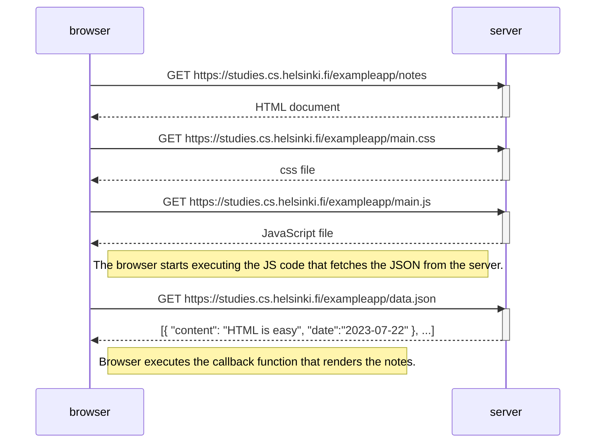
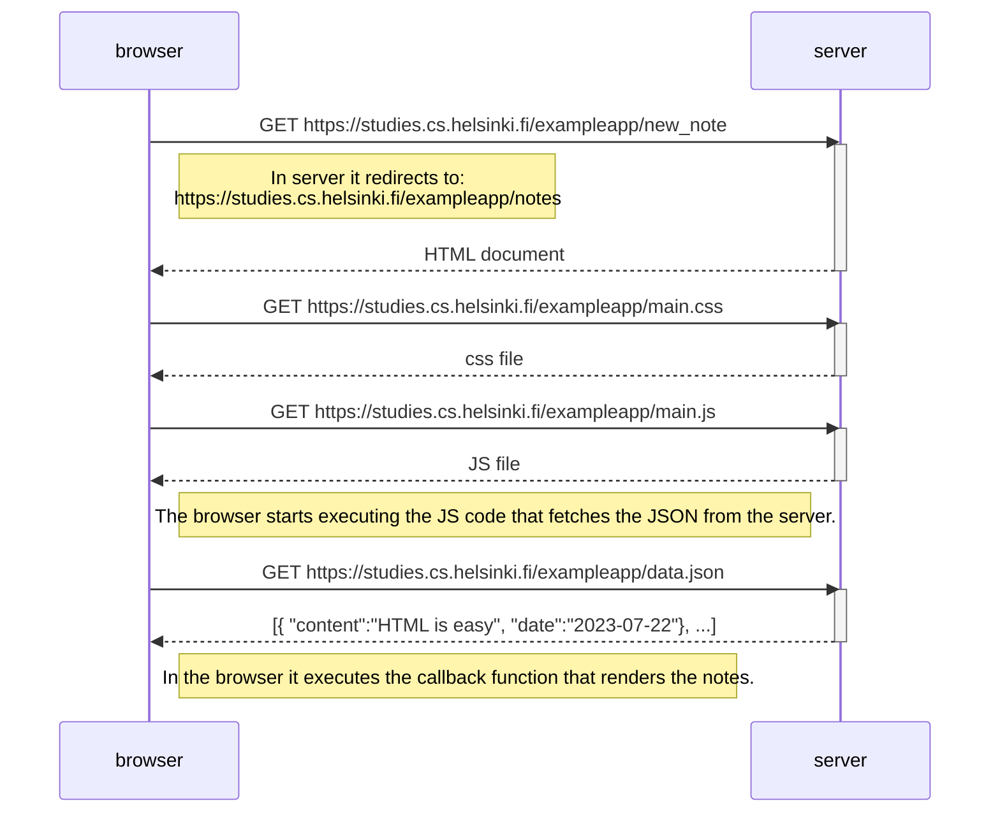

## QUESTION STATEMENT

**Sequence diagram** It depicts the situation where user visits the page: https://studies.cs.helsinki.fi/exampleapp/notes

REQUIREMENT: Creating a Sequence Diagram to illustrate the scenario where the user adds a new note on the page https://studies.cs.helsinki.fi/exampleapp/notes by adding some texts into text field and submitting it.

**<u>Solution:</u>**

