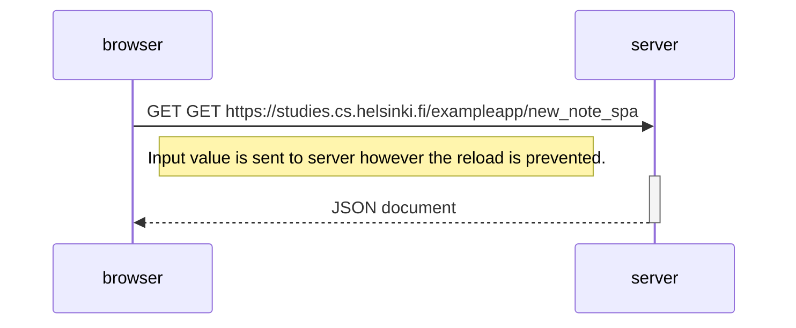

## 0.6: New note in SINGLE PAGE APP DIAGRAM

Here, diagram illustrates the user creating new note in the SPA version of the app.

The sequence diagram illustrates the events when user click 'save' button.

<u>NB: It doesn't includes events while user entering into the site.</u>

